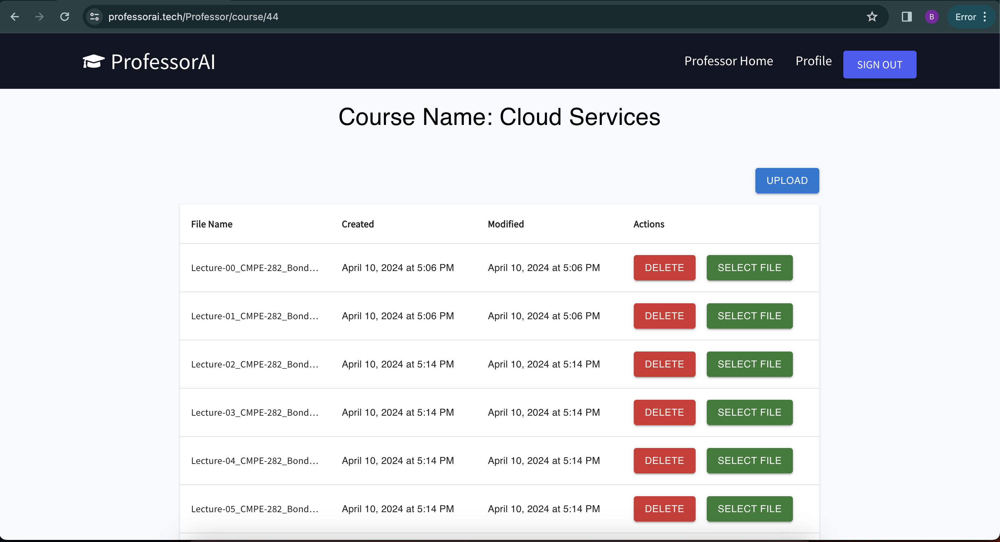
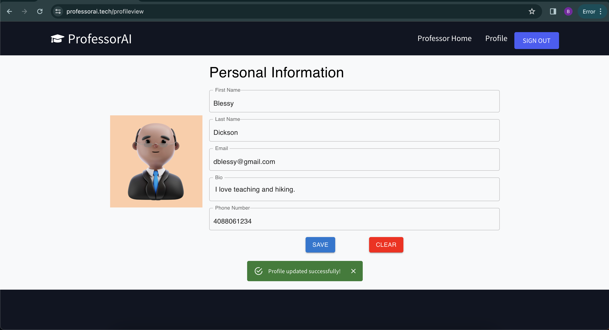
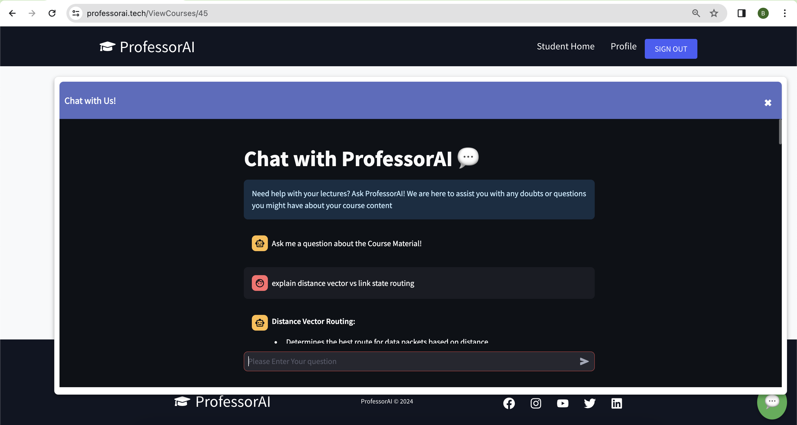
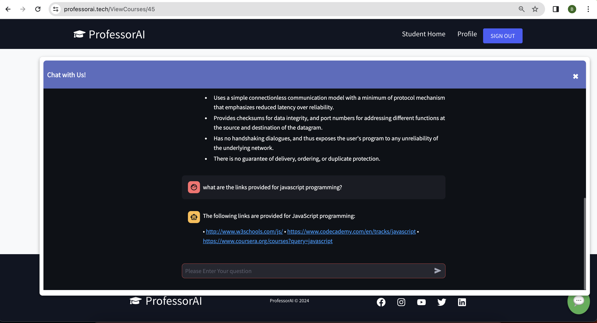

 
<b>Course Name :</b> CMPE-295B - Master Project II

<b>Project Name  :</b> ProfessorAI

<b>Application URL :</b> https://professorai.tech

<b>University Name :</b> [San Jose State University](https://www.sjsu.edu/)

<b>Professor's Name :</b> [Andrew Bond](https://www.linkedin.com/in/ahbond/)

<b>Team Name :</b> Code Wizards

<b>Team Members:</b>  

- [Bhavya Hegde](https://www.linkedin.com/in/bhavya-hegde/)
- [Blessy Dickson Daniel Moses](https://www.linkedin.com/in/blessy-dickson-348a31133/)
- [Darshini Venkatesha Murthy Nag](https://www.linkedin.com/in/darshini-venkatesha-murthy-nag-90052756/)
- [Sirisha Polisetty](https://www.linkedin.com/in/sirishapolisetty/)

## Introduction
ProfessorAI is designed to tackle the challenges faced by students and professors in today's digital learning environment. Our platform addresses student procrastination and the difficulties professors encounter in delivering comprehensive course materials within limited class hours. By developing a user-friendly platform equipped with a chatbot for easy access to a variety of educational resources, including video presentations and PDFs, ProfessorAI aims to encourage consistent student engagement throughout the semester and enhance the educational journey. Leveraging advanced AI technology and large language models, ProfessorAI seeks to revolutionize the learning experience, making it more seamless and effective for both students and professors.

## Problem Statement
Professors face the challenge of effectively delivering a comprehensive curriculum within a limited time, compounded by students' frequent concentration lapses. There is a crucial need for a platform that allows professors to archive their course materials, including lecture videos, in a format that enables students to engage with the content through interactive, conversational experiences.

## Solution Proposed
The proposed solution involves leveraging Large Language Models (LLMs) through the ProfessorAI platform to enhance educational experiences. This method allows professors to upload their course content onto the platform. The LLM then processes, learns, and organizes this data efficiently. Students benefit by engaging with a chat application that gives them access to any information related to their coursework. This system is not limited to mere summarization; it also encourages deeper exploration of subjects, aided by additional resources like books recommended by professors. This approach fundamentally transforms and enriches the student learning journey by providing a more dynamic, interactive, and comprehensive educational tool.

## Application Features

### Professor Features
* Professors can login into the application using google SSO credentials.
* Professor flow functionality includes a dashboard, where professors can view the list of courses they teach.
* View list of enrolled students for each course they teach.
* Upload course materials either from device or by using dropbox.
* Embedding Generation for the uploaded course materials.
* View the uploaded course material using the file viewer.
* Update Bio and Phone Number in the personal information.

### Student Features
* Students can login into the application using google SSO credentials.
* Student flow functionality includes a dashboard, where students can view their list of enrolled courses.
* View the professor uploaded course material using the file viewer.
* Ask questions and receive response related to course material using the conversational chat interface.
* Update Bio and Phone Number in the personal information.

### Admin Features
* Admins can login into the application using token-based authentication.
* Admins functionality includes to add a course by providing course details and to remove a course.
* To register student and professor to the platform, and to remove users.
* To enroll a student to courses.
* To assign a professor to course.
* To submit administrative inquries using the admin query interface.

  

## Technologies and Tools used

Frontend : ReactJS, Material UI  
Backend : NodeJS, Flask  
Database : MySQL, ChromaDB(Embedding DB)  
LLM: Mistral 7B  
Embedding model: bge-en-large  
Tools used : Visual Studio code/Any IDE  
AWS components : EC2, Route 53, RDS, SNS, S3, CloudFront  
GCP components : VertexAI, Google Compute Engine, Google Managed Certificate, Load Balancer  
External APIs : Google's Gemini API, Google Auth API, Dropbox API  

## Architecture Diagram

## Application Screenshots
#### Home Page

#### Login Page

#### Professor Dashboard

#### Professor Course Page

#### Professor Profile Page

#### Student Dashboard 

#### Student Chat 

#### Admin Dashboard

#### Admin Query Interface

